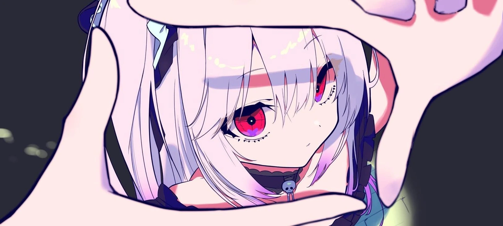

  

# 💫 About Me

- 🌍 Bandung, West Java
- 🧑‍🎓 I'm a Student
- 💻 Passionate about **Web Development**
- ✨ Currently learning **Next.js**, **ReactJS**

# 💻 Tech Stack

# 📊 GitHub Stats

  
  

# 🌐 Social Media

  
  

# 🎮 Fun Animations

---

  
  

