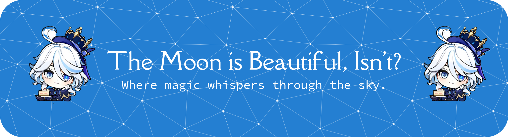

  

## 💫 About Me

- 🌍 Bandung, West Java
- 🧑‍🎓 I'm a Student
- 💻 Passionate about **Web Development**
- ✨ Currently learning **Next.js**, **ReactJS**, and **Cloud Technologies**

## 💻 Tech Stack

## 📊 GitHub Stats

  
  

## 🌐 Social Media

  
  

## 🎮 Fun Animations

### 🟨 Pac-Man Contribution Graph

<picture>
  <source media="(prefers-color-scheme: dark)" srcset="https://raw.githubusercontent.com/iReiii/iReiii/output/pacman-contribution-graph-dark.svg">
  <source media="(prefers-color-scheme: light)" srcset="https://raw.githubusercontent.com/iReiii/iReiii/output/pacman-contribution-graph.svg">
  
</picture>

### 🐍 GitHub Snake

